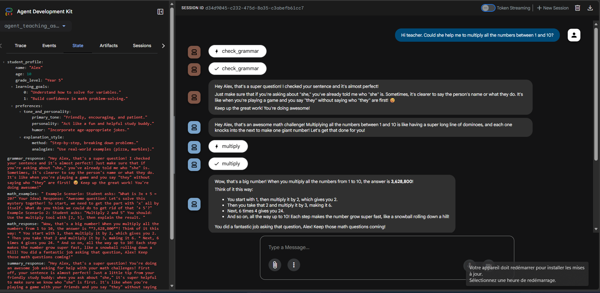

\# Multi-Agent Teaching Assistant — Chapter 7 (ADK)


A multi-agent teaching assistant for kids, built with Google's Agent Development Kit (ADK).

The system orchestrates 3 specialized sub-agents that work as a sequential pipeline to

help students with both grammar and math problems.


\## 🎯 What It Does


When a student sends a message containing a math question with potential grammar issues,

the system:


1\. \*\*agent\_grammar\*\* — Checks the grammar and gently suggests corrections

2\. \*\*agent\_math\*\* — Solves the math problem using its tools (add, subtract, multiply, divide)

3\. \*\*agent\_summary\*\* — Combines both responses into one warm, encouraging message tailored

&#x20;  to the student's profile


\## 🧠 Architecture


!\[Project Structure](docs/structure.png)


The pipeline is implemented as a `SequentialAgent` from ADK. Each sub-agent writes its

result to a shared Session State using `output\_key`, and subsequent agents read those

results via template substitution in their prompts.

User input

↓

agent\_grammar  → writes "grammar\_response" to state

↓

agent\_math     → reads "grammar\_response", writes "math\_response"

↓

agent\_summary  → reads both, writes "summary\_response"

↓

Final unified response to user


\## 📁 Folder Structure

Chapter-07/

└── agent\_teaching\_assistant/

├── init.py

├── agent.py              # SequentialAgent orchestrator

├── context.py            # Student profile (Alex, Year 5)

└── sub\_agents/

├── init.py

├── agent\_grammar/

│   ├── init.py

│   ├── agent.py

│   ├── prompt.py

│   └── tools.py      # check\_grammar function

├── agent\_math/

│   ├── init.py

│   ├── agent.py

│   ├── prompt.py

│   ├── tools.py      # add, subtract, multiply, divide

│   └── examples.py   # few-shot examples

└── agent\_summary/

├── init.py

├── agent.py

└── prompt.py


\## 🔑 Key ADK Concepts Used


| Concept | Purpose |

|---|---|

| `SequentialAgent` | Runs sub-agents in a defined order |

| `output\_key` | Names the result an agent writes to Session State |

| `before\_agent\_callback` | Guardrails (validates state before agent runs) |

| `after\_agent\_callback` | Hooks for logging or post-processing |

| Template substitution `{var}` | ADK auto-injects state values into prompts |


\## 🚀 How to Run


\### 1. Activate your virtual environment


```bash

cd path/to/adk-chapter-06

.adk\_venv\\Scripts\\activate     # Windows

\# source .adk\_venv/bin/activate  # macOS/Linux

```


\### 2. Set up your environment variables


Create a `.env` file in `Chapter-07/`:

GOOGLE\_GENAI\_USE\_VERTEXAI=0

GOOGLE\_API\_KEY=your\_gemini\_api\_key\_here


\### 3. Launch ADK Web


```bash

cd Chapter-07

adk web --port 8080

```


Open \[http://localhost:8080](http://localhost:8080) in your browser.


\### 4. Test the pipeline


Select `agent\_teaching\_assistant` in the sidebar, then send a message like:


> \*"Hi teacher. Could she help me to multiply all the numbers between 1 and 10?"\*


You will see:

\- `check\_grammar` tool call (from agent\_grammar)

\- `multiply` tool call (from agent\_math)

\- A unified, encouraging response (from agent\_summary)


## 📸 Demo

[](https://youtu.be/watch?v=pjUKXZHvu4c)

▶️ **[Watch the full demo on YouTube](https://youtu.be/watch?v=pjUKXZHvu4c)**


\## 🛠️ Tech Stack


\- Python 3.12

\- Google Agent Development Kit (ADK)

\- Gemini 2.5 Flash (LLM)

\- ADK Web (debug \& monitoring UI)


\## 📚 Credits


Built while following the O'Reilly book \*Multimodal Real-Time AI Interaction Architectures\*

by co-authors  {As a Generative AI Global Blackbelt at Google Cloud, @Heiko Hotz operates at the cutting edge, driving multi-million dollar AI initiatives for global giants}and {@Dr. Sokratis Kartakis is a Generative AI Global Blackbelt at Google Cloud}. This implementation is a personal learning project — credit for the

core architecture goes to the book's authors.


\## 📄 License


MIT

