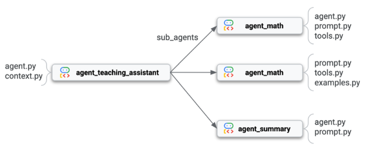

# Multi-Agent Teaching Assistant

A multi-agent teaching assistant for kids, built with Google's Agent Development Kit (ADK).
Three specialized sub-agents work as a sequential pipeline to help students with both
grammar and math problems — adapting tone and style to the student's profile.

## 🎬 Demo

[](https://youtu.be/pjUKXZHvu4c)

▶️ **[Watch the full demo on YouTube](https://youtu.be/pjUKXZHvu4c)**

## 🎯 What It Does

When a student sends a message with potential grammar issues and a math question, the system:

1. **agent_grammar** — Checks the grammar and gently suggests corrections
2. **agent_math** — Solves the math problem using its tools (add, subtract, multiply, divide)
3. **agent_summary** — Combines both responses into one warm, encouraging message tailored to the student's profile

## 🧠 Architecture



The pipeline is implemented as a `SequentialAgent` from ADK. Each sub-agent writes its
result to a shared Session State using `output_key`, and subsequent agents read those
results via template substitution in their prompts.
User input
↓
agent_grammar  → writes "grammar_response"
↓
agent_math     → reads grammar_response, writes "math_response"
↓
agent_summary  → reads both, writes "summary_response"
↓
Final unified response to user

## 📁 Folder Structure
multi-orchestrated-agent/
└── agent_teaching_assistant/
├── init.py
├── agent.py              # SequentialAgent orchestrator
├── context.py            # Student profile (Alex, Year 5)
└── sub_agents/
├── init.py
├── agent_grammar/
│   ├── init.py
│   ├── agent.py
│   ├── prompt.py
│   └── tools.py      # check_grammar function
├── agent_math/
│   ├── init.py
│   ├── agent.py
│   ├── prompt.py
│   ├── tools.py      # add, subtract, multiply, divide
│   └── examples.py   # few-shot examples
└── agent_summary/
├── init.py
├── agent.py
└── prompt.py

## 🔑 Key ADK Concepts Used

| Concept | Purpose |
|---|---|
| `SequentialAgent` | Runs sub-agents in a defined order |
| `output_key` | Names the result an agent writes to Session State |
| `before_agent_callback` | Guardrails (validates state before agent runs) |
| `after_agent_callback` | Hooks for logging or post-processing |
| Template substitution `{var}` | ADK auto-injects state values into prompts |

## 🚀 How to Run

### 1. Activate your virtual environment

```bash
cd path/to/adk-multi-agent-systems
.adk_venv\Scripts\activate          # Windows
# source .adk_venv/bin/activate     # macOS/Linux
```

### 2. Set up your environment variables

Create a `.env` file in `multi-orchestrated-agent/`:
GOOGLE_GENAI_USE_VERTEXAI=0
GOOGLE_API_KEY=your_gemini_api_key_here

### 3. Launch ADK Web

```bash
cd multi-orchestrated-agent
adk web --port 8080
```

Open [http://localhost:8080](http://localhost:8080) in your browser.

### 4. Test the pipeline

Select `agent_teaching_assistant` in the sidebar, then send a message like:

> *"Hi teacher. Could she help me to multiply all the numbers between 1 and 10?"*

You will see:
- `check_grammar` tool call (from agent_grammar)
- `multiply` tool call (from agent_math)
- A unified, encouraging response (from agent_summary)

## 🛠️ Tech Stack

- Python 3.12
- Google Agent Development Kit (ADK)
- Gemini 2.5 Flash
- ADK Web (debug & monitoring UI)

## 📚 Credits

Built while following the O'Reilly book *Multimodal Real-Time AI Interaction Architectures*
by **Heiko Hotz** (Generative AI Global Blackbelt at Google Cloud) and
**Dr. Sokratis Kartakis** (Generative AI Global Blackbelt at Google Cloud).

This implementation is a personal learning project — credit for the core architecture
goes to the book's authors.

## 📄 License

MIT